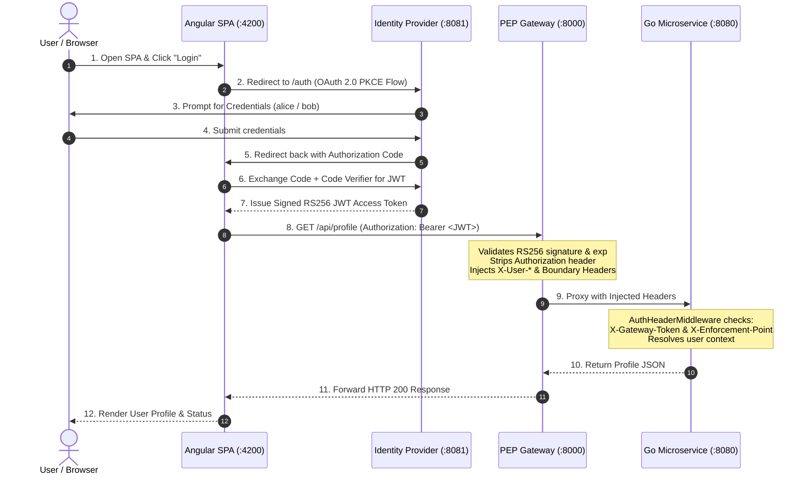

# Auth Architecture Proof-of-Concept (PoC)

A contract-first, zero-trust APIM boundary architecture demonstrating the strict decoupling of user identity verification (**Keycloak** or **ZITADEL** IdP) from perimeter policy enforcement (**KrakenD**, **Kong**, or **Tyk** API Gateway PEP) and downstream business logic (**Go Microservice**), consumed by a modern **Angular 19 SPA**.

---

## 1. Architectural Principles & Concepts



- **Authentication (AuthN) Boundary (Keycloak / ZITADEL IdP)**:
  The IdP centralizes credential verification, user federation, client scopes, and signing key management. It issues cryptographically signed RS256 JSON Web Tokens (JWT) containing normalized identity claims (`preferred_username`, `email`, `roles`).
- **Authorization Code Flow with PKCE**:
  Single Page Applications (SPAs) are public clients unable to securely store secrets. The Authorization Code Flow with Proof Key for Code Exchange (PKCE) guarantees code exchange integrity directly within the browser without client secrets.
- **Token Offloading (PEP Gateway Boundary)**:
  The gateway (**KrakenD**, **Kong**, or **Tyk**) operates as the perimeter Policy Enforcement Point (PEP). It offloads JWT verification, signature checking, and key validation from upstream services, stripping the raw `Authorization` header so downstream services never handle tokens.
- **Trusted Header Injection & Anti-Spoofing Guardrails**:
  The gateway injects verified identity claims (`X-User-Username`, `X-User-Email`, `X-User-Role`) alongside boundary assertion headers:
  - `X-Gateway-Token: poc-gateway-secret-token`
  - `X-Enforcement-Point`: `KrakenD-APIM-Boundary`, `Kong-APIM-Boundary`, or `Tyk-APIM-Boundary`
- **Zero-Trust Microservice Defense-in-Depth**:
  Downstream microservices remain completely decoupled from OAuth/OIDC mechanics. The Go backend's `AuthHeaderMiddleware` validates the presence and authenticity of boundary assertion headers before allowing requests through, rejecting unverified or bypassed requests with **HTTP 403 Forbidden**.

---

## 2. Credentials & Access Reference Tables

### 2.1 Unified GUI Admin & Service Access Table

| Service / Component | Type | URL / Endpoint | Admin User / Login | Password / Secret | Description |
|---|---|---|---|---|---|
| **Keycloak IdP** | GUI Console | [http://localhost:8081/admin](http://localhost:8081/admin) | `admin` | `admin` | Master realm admin console |
| **ZITADEL IdP** | GUI Console | [http://localhost:8081/ui/console](http://localhost:8081/ui/console) | `admin` (or `admin@localhost`) | `Password123!` | Root instance management console |
| **Angular 19 SPA** | Client Web App | [http://localhost:4200](http://localhost:4200) | *See Demo Users below* | *See Demo Users below* | PoC frontend client application |
| **Kong Gateway** | Admin REST API | [http://localhost:8001](http://localhost:8001) | *None* | *None* | Declarative status & route inspection |
| **KrakenD Gateway** | Health / Config | [http://localhost:8000/__health](http://localhost:8000/__health) | *None* | *None* | Stateless engine ([KrakenD Designer GUI](https://designer.krakend.io/)) |
| **Tyk Gateway** | Gateway API | [http://localhost:8000/hello](http://localhost:8000/hello) | *None* | `tyk-secret-key-352d20ee67be` | Headless mode (via `x-tyk-authorization`) |
| **Keycloak DB** | PostgreSQL | `localhost:5432` (`postgres:5432`) | `keycloak` | `keycloak_pass` | Keycloak persistence database (`keycloak`) |
| **ZITADEL DB** | PostgreSQL | `localhost:5432` (`zitadel-postgres:5432`) | `zitadel` | `zitadel_pass` | ZITADEL persistence database (`zitadel`) |

---

### 2.2 Demo Application Users (Login into Angular SPA)

Use these credentials when clicking **"Login"** at [http://localhost:4200](http://localhost:4200):

| Username | Password (Keycloak) | Password (ZITADEL) | Email | Assigned Role | Permissions & Behavior |
|---|---|---|---|---|---|
| **`alice`** | **`alice123`** | **`Alice123!`** | `alice@example.com` | `user` | **Standard User**: Allowed on `/api/profile`, **Forbidden (403)** on `/api/admin`. |
| **`bob`** | **`bob123`** | **`Bob1234!`** | `bob@example.com` | `admin`, `user` | **Administrator**: Allowed on `/api/profile`, **Authorized (200)** on `/api/admin`. |

---

### 2.3 Keycloak Administration Console (Keycloak Stack)

Manage realms, clients, user attributes, and roles at [http://localhost:8081/admin](http://localhost:8081/admin):

| Parameter | Value | Description |
|---|---|---|
| **Admin Console URL** | `http://localhost:8081/admin` | Keycloak Web Console |
| **Admin Username** | **`admin`** | Master realm administrator |
| **Admin Password** | **`admin`** | Master realm administrator password |
| **Target Realm** | **`auth-realm`** | Application realm containing the PoC configuration |
| **Client ID** | **`angular-spa`** | Public OIDC Client (PKCE enabled, **no client secret required**) |

---

### 2.4 ZITADEL Management Console (ZITADEL Stack)

Manage organizations, projects, applications, and users at [http://localhost:8081/ui/console](http://localhost:8081/ui/console):

| Parameter | Value | Description |
|---|---|---|
| **Console URL** | `http://localhost:8081/ui/console` | ZITADEL Management Web Console |
| **Admin Login** | `admin` / `admin@localhost` | Root instance administrator |
| **Admin Password** | **`Password123!`** | Instance administrator password |
| **Project** | **`auth-spa-poc`** | Application project containing roles and OIDC client |
| **Client ID** | `391627259401797638` | Native ZITADEL OIDC Public Client |

---

### 2.5 API Gateways (KrakenD, Kong & Tyk PEP) & Boundary Tokens

| Parameter | Setting / Value | Description |
|---|---|---|
| **KrakenD Proxy Endpoint** | `http://localhost:8000` | KrakenD gateway entrypoint for API calls |
| **KrakenD Health Check** | `http://localhost:8000/__health` | Gateway liveness endpoint |
| **Kong Proxy Endpoint** | `http://localhost:8000` | Kong gateway entrypoint for API calls |
| **Kong Admin API** | `http://localhost:8001` | Declarative configuration and status endpoint (Kong stack) |
| **Tyk Proxy Endpoint** | `http://localhost:8000` | Tyk gateway entrypoint for API calls |
| **Tyk Health / Hello Check** | `http://localhost:8000/hello` | Gateway liveness endpoint |
| **Tyk Gateway Secret** | `tyk-secret-key-352d20ee67be` | Tyk API header secret (`x-tyk-authorization`) |
| **Boundary Gateway Secret** | `poc-gateway-secret-token` | Injected as `X-Gateway-Token`, validated by Go microservice |
| **KrakenD Enforcement Point**| `KrakenD-APIM-Boundary` | Injected as `X-Enforcement-Point` by KrakenD, validated by Go microservice |
| **Kong Enforcement Point** | `Kong-APIM-Boundary` | Injected as `X-Enforcement-Point` by Kong, validated by Go microservice |
| **Tyk Enforcement Point** | `Tyk-APIM-Boundary` | Injected as `X-Enforcement-Point` by Tyk, validated by Go microservice |

---

### 2.6 Database Persistence

| Stack | Service / Port | Database | Username | Password |
|---|---|---|---|---|
| **Keycloak** | `postgres:5432` | `keycloak` | `keycloak` | `keycloak_pass` |
| **ZITADEL** | `zitadel-postgres:5432`| `zitadel` | `zitadel` | `zitadel_pass` |

---

## 3. Architecture & Implementation Guides

For in-depth specifications, architectural internals, gateway comparison, and module-specific guides, refer to:

### 3.1 Gateway PEP Deep Dives

- 🦍 **[Kong Implementation Guide](docs/KONG-Implementation-Guide.md)**: Declarative DB-less setup, JWT plugin, Lua claim transformation (`post-function`), anti-spoofing injection, and Kong Admin API.
- 🐙 **[KrakenD Implementation Guide](docs/KRAKEND-Implementation-Guide.md)**: Stateless Lura Go engine, dynamic JWKS caching (`auth/validator`), Martian request modifiers, and ultra-high-throughput routing.
- 🛡️ **[Tyk Implementation Guide](docs/TYK-Implementation-Guide.md)**: Headless open-source setup, Redis session storage, RS256 JWT validation, and JavaScript Virtual Machine (JSVM) middleware.

### 3.2 System Architecture & Component Guides

- 📚 **[Documentation Index](docs/README.md)**: Centralized guide directory, comparative gateway/IdP matrix, and reading pathways.
- 📖 **[PoC Master Architecture Guide](docs/POC-Implementation-guide.md)**: Contract-first zero-trust APIM boundary principles, comparative gateway evaluation matrix, network isolation, and PKCE flow.
- 📋 **[Project Implementation Plan](docs/Project-Implementation-plan.md)**: Multi-phase delivery plan, zero-trust boundary specifications, and verification milestones.
- 🔐 **[ZITADEL Implementation Plan](docs/ZITADEL-Implementation-Plan.md)**: Dual-IdP integration plan detailing Keycloak and ZITADEL compatibility.
- 🖥️ **[Frontend Application (Angular 19)](frontend/README.md)**: Dual-IdP support, OAuth 2.0 Authorization Code Flow with PKCE, client-side JWT claims parsing, and `AuthInterceptor`.
- ⚙️ **[Backend Microservice (Go)](backend/README.md)**: Zero-Trust boundary verification (`X-Gateway-Token`, `X-Enforcement-Point`), identity context extraction, RBAC enforcement (`/api/admin`), and unit test suite.

---

## 4. Project Directory Structure

```text
auth-spa-poc/
├── docker-compose.yml              # Complete environment orchestration (KrakenD API GW + Keycloak IdP)
├── docker-compose.krakend.yml      # Explicit KrakenD stack compose file
├── docker-compose.keycloak-kong.yml# Complete environment orchestration (Kong API GW + Keycloak IdP)
├── docker-compose.tyk.yml          # Complete environment orchestration (Tyk API GW + Keycloak IdP)
├── docker-compose.zitadel.yml      # Complete environment orchestration (Kong API GW + ZITADEL IdP)
├── README.md                       # Main documentation and access guide
├── docs/                           # Centralized documentation and implementation guides
│   ├── README.md                   # Documentation index & reading paths
│   ├── POC-Implementation-guide.md # Master architectural guide and requirements
│   ├── Project-Implementation-plan.md # Detailed implementation plan
│   ├── KONG-Implementation-Guide.md # Kong gateway deep dive
│   ├── KRAKEND-Implementation-Guide.md # KrakenD gateway deep dive
│   ├── TYK-Implementation-Guide.md # Tyk gateway deep dive
│   └── ZITADEL-Implementation-Plan.md # ZITADEL IdP integration plan
├── README.md                       # Main documentation and access guide
├── keycloak/
│   └── realm-export.json           # Declarative Keycloak realm export with RS256 keypair
├── zitadel/
│   ├── bootstrap/                  # Automated provisioning and Kong key sync
│   └── steps.yaml                  # ZITADEL initialization configuration
├── krakend/
│   ├── README.md                   # KrakenD directory documentation
│   ├── krakend.json                # Declarative configuration for Keycloak IdP
│   └── krakend.zitadel.json        # Declarative configuration for ZITADEL IdP
├── kong/
│   ├── README.md                   # Kong directory documentation
│   ├── kong.yml                    # Declarative configuration for Keycloak IdP
│   └── kong.zitadel.yml            # Declarative configuration for ZITADEL IdP
├── tyk/
│   ├── README.md                   # Tyk directory documentation
│   ├── tyk.conf                    # Declarative headless gateway configuration
│   ├── apps/
│   │   └── app-backend.json        # API definition with JWT & CORS
│   ├── policies/
│   │   └── policies.json           # Headless security policies
│   └── middleware/
│       └── auth-transform.js       # JS middleware for JWT claims & header injection
├── backend/
│   ├── README.md                   # 📖 Backend architecture, zero-trust headers & RBAC guide
│   ├── go.mod                      # Go module definition
│   ├── main.go                     # Go microservice with zero-trust middleware & RBAC
│   ├── main_test.go                # Unit test suite for boundary and authorization
│   └── Dockerfile.backend          # Multi-stage minimal container build
└── frontend/
    ├── README.md                   # 📖 Frontend architecture, JWT claims & PKCE guide
    ├── angular.json                # Angular CLI configuration
    ├── package.json                # Angular dependencies (including angular-oauth2-oidc)
    ├── nginx.conf                  # Nginx configuration with CSP and security headers
    ├── Dockerfile.frontend         # Nginx production container
    └── src/
        ├── index.html              # HTML shell with meta tags and fonts
        ├── styles.css              # Global styles, dark-mode theme, CSS variables
        ├── main.ts                 # Bootstrap entrypoint
        └── app/
            ├── app.config.ts       # Application providers & HTTP interceptors
            ├── app.component.ts    # Main component with IdP combo selector & test suite
            ├── app.component.html  # Responsive UI template with sequence flow & console
            ├── app.component.css   # Glassmorphism, animations, and status pills
            ├── auth.service.ts     # Multi-IdP PKCE service (Keycloak & ZITADEL)
            ├── zitadel.service.ts  # ZITADEL-specific claim & role utilities
            └── auth.interceptor.ts # Interceptor injecting Bearer tokens for API Gateway (:8000)
```

---

## 5. Quick Start & Stacks Switcher

All stacks expose the same external ports (`:4200` for SPA, `:8000` for PEP Gateway, `:8080` for Backend, `:8081` for IdP). **Ensure previous stacks are stopped before launching a new one.**

### 5.1 Stacks Comparison & Launcher Matrix

| Stack | IdP | Gateway PEP | Storage | Command to Run |
|---|---|---|---|---|
| **KrakenD + Keycloak** *(Default)* | Keycloak (`:8081`) | KrakenD (`:8000`) | PostgreSQL | `docker compose up -d` |
| **Kong + Keycloak** | Keycloak (`:8081`) | Kong (`:8000`, `:8001`) | PostgreSQL | `docker compose -f docker-compose.keycloak-kong.yml up -d` |
| **Tyk + Keycloak** | Keycloak (`:8081`) | Tyk (`:8000`) | PostgreSQL + Redis | `docker compose -f docker-compose.tyk.yml up -d` |
| **Kong + ZITADEL** | ZITADEL (`:8081`) | Kong (`:8000`, `:8001`) | ZITADEL PostgreSQL | `docker compose -f docker-compose.zitadel.yml up -d` |

---

### 5.2 Starting the KrakenD Stack (Default)

```bash
# 1. Start the KrakenD stack
docker compose up -d
# or explicitly:
# docker compose -f docker-compose.krakend.yml up -d

# 2. Check running services
docker compose ps

# 3. Stop
docker compose down
```

---

### 5.3 Starting the Keycloak + Kong Stack

```bash
# 1. Stop current stack if running
docker compose down

# 2. Launch Keycloak + Kong stack
docker compose -f docker-compose.keycloak-kong.yml up -d

# 3. Check running services
docker compose -f docker-compose.keycloak-kong.yml ps

# 4. Stop
docker compose -f docker-compose.keycloak-kong.yml down
```

---

### 5.4 Starting the Keycloak + Tyk Stack

```bash
# 1. Stop current stack if running
docker compose down

# 2. Launch Keycloak + Tyk stack
docker compose -f docker-compose.tyk.yml up -d

# 3. Check running services
docker compose -f docker-compose.tyk.yml ps

# 4. Stop
docker compose -f docker-compose.tyk.yml down
```

---

### 5.5 Starting the ZITADEL + Kong Stack

```bash
# 1. Ensure other stacks are stopped
docker compose down

# 2. Launch the ZITADEL stack
docker compose -f docker-compose.zitadel.yml up -d

# 3. Check running services
docker compose -f docker-compose.zitadel.yml ps

# 4. Stop
docker compose -f docker-compose.zitadel.yml down
```

---

## 6. Interactive Testing & Verification Guide

### 6.1 Browser Testing (Angular SPA)

Open **[http://localhost:4200](http://localhost:4200)** in your browser:

1. **Direct Bypass Test (Zero-Trust Validation)**:
   - Click **"Test Direct Bypass"** (`http://localhost:8080/api/profile`).
   - The Go backend detects the absence of `X-Gateway-Token` and `X-Enforcement-Point` and rejects the call with **`HTTP 403 Forbidden`** (`Forbidden: Untrusted gateway boundary`).
2. **Dual-IdP Authentication (Keycloak & ZITADEL)**:
   - Select your desired provider from the **IdP Provider** dropdown combo in the navbar (**Keycloak IdP** or **ZITADEL IdP**).
   - Click **"Login with [Provider]"** (redirects to `:8081`).
   - Log in with `alice` or `bob` (see credentials table in Section 2.1).
   - Upon return to the SPA, verify your username, email, and active status.
3. **Gateway Token Offloading & Claims Assertion**:
   - Click **"Test Gateway API"** (`http://localhost:8000/api/profile`).
   - The gateway verifies the JWT, removes the token, injects identity headers, and passes the request upstream.
   - The response console displays **`HTTP 200 OK`** with `Welcome alice (alice@example.com) [Role: user]`.
4. **Role-Based Access Control (RBAC)**:
   - Click **"Test Admin RBAC"** (`http://localhost:8000/api/admin`).
   - For `alice`: returns **`HTTP 403 Forbidden`** (`Insufficient privileges (admin role required)`).
   - Log out, log in with `bob`, and test again: returns **`HTTP 200 OK`** (`Authorized admin access granted for bob`).
5. **JWT Claims Inspection**:
   - Click the **"Token & Claims"** tab to view the live decoded JWT payload claims (including issuer, subject, email, and resolved roles).

---

### 6.2 Automated CLI & Curl Testing

#### 1. Test Direct Backend Access (Expected: 403 Forbidden)
```bash
curl -i http://localhost:8080/api/profile
```

#### 2. Test Gateway PEP without JWT (Expected: 401 Unauthorized)
```bash
curl -i http://localhost:8000/api/profile
```

#### 3. Test CORS Preflight on Gateway (Expected: 200 OK with CORS headers)
```bash
curl -i -X OPTIONS -H "Origin: http://localhost:4200" \
  -H "Access-Control-Request-Method: GET" \
  -H "Access-Control-Request-Headers: Authorization" \
  http://localhost:8000/api/profile
```

#### 4. Authenticated Profile Call with Alice Token (Expected: 200 OK)
```bash
# Obtain token for alice from Keycloak
ALICE_TOKEN=$(curl -s -X POST http://localhost:8081/realms/auth-realm/protocol/openid-connect/token \
  -H "Content-Type: application/x-www-form-urlencoded" \
  -d "client_id=angular-spa&grant_type=password&username=alice&password=alice123&scope=openid profile email roles" | jq -r '.access_token')

# Call API Gateway PEP
curl -i -H "Authorization: Bearer $ALICE_TOKEN" http://localhost:8000/api/profile
```

#### 5. Role-Based Access Control Test with Alice (Expected: 403 Forbidden)
```bash
curl -i -H "Authorization: Bearer $ALICE_TOKEN" http://localhost:8000/api/admin
```

#### 6. Role-Based Access Control Test with Bob (Expected: 200 OK)
```bash
# Obtain token for bob (admin) from Keycloak
BOB_TOKEN=$(curl -s -X POST http://localhost:8081/realms/auth-realm/protocol/openid-connect/token \
  -H "Content-Type: application/x-www-form-urlencoded" \
  -d "client_id=angular-spa&grant_type=password&username=bob&password=bob123&scope=openid profile email roles" | jq -r '.access_token')

# Call API Gateway PEP
curl -i -H "Authorization: Bearer $BOB_TOKEN" http://localhost:8000/api/admin
```

#### 7. Run Go Backend Unit Tests
```bash
cd backend && go test -v ./...
```

---

## 7. Troubleshooting & FAQ Guide

### 7.1 Port Conflicts (`8000`, `8080`, `8081`, `4200`)
All 4 stacks map the same host ports. If starting a new stack fails with `bind: address already in use`:
```bash
# Identify and stop any running compose stacks
docker compose down
docker compose -f docker-compose.krakend.yml down
docker compose -f docker-compose.keycloak-kong.yml down
docker compose -f docker-compose.tyk.yml down
docker compose -f docker-compose.zitadel.yml down
```

### 7.2 Keycloak Realm Import & Clean Slate Reset
Keycloak only imports `realm-export.json` on the initial database creation. If you modify `realm-export.json`:
```bash
# Stop and remove postgres volume to trigger a fresh import
docker compose down -v
docker compose up -d
```

### 7.3 ZITADEL Initial Provisioning Timing
When starting the ZITADEL stack (`docker-compose.zitadel.yml`), the `zitadel-bootstrap` container runs database migrations and provisions the client keys:
- Wait ~30-45 seconds for `zitadel-bootstrap` to finish (`status: Exited (0)`).
- Monitor logs via: `docker compose -f docker-compose.zitadel.yml logs -f zitadel-bootstrap`.

### 7.4 Tyk Redis Connection & Liveness
Tyk requires Redis to store keys and session state. If Tyk fails to start, verify that `tyk-redis` is running on the `auth-net` network:
```bash
docker compose -f docker-compose.tyk.yml logs tyk-redis
curl http://localhost:8000/hello
```

### 7.5 Browser CORS Preflight Caching
If you switch gateways and notice persistent preflight errors in the browser, clear the browser's CORS cache or use an Incognito / Private browsing window.

---

## 8. Zero-Trust Network Defense in Kubernetes

When deploying to Kubernetes (K3s, EKS, GKE), internal network isolation is enforced through network policies:
- Microservices are exposed exclusively via **ClusterIP** (never NodePort or LoadBalancer).
- A Kubernetes `NetworkPolicy` explicitly permits TCP ingress to port 8080 **only** from pods bearing the PEP gateway label (`app: krakend`, `app: kong`, or `app: tyk`).
- Direct traffic attempts from other pods or external ingress are dropped at the network layer, preventing header spoofing and perimeter bypass attacks.
