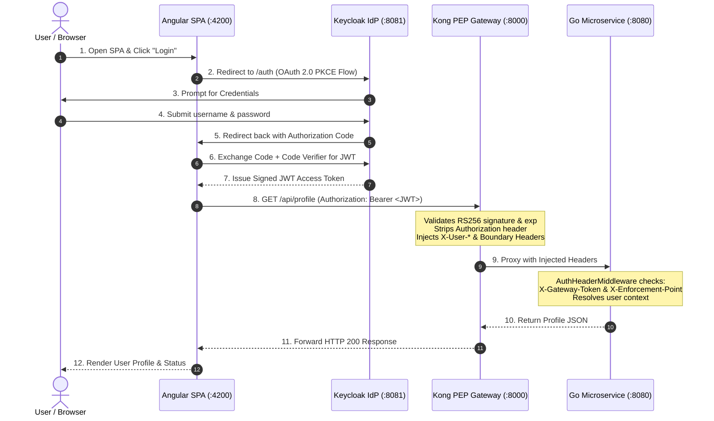

# Aitana Auth Architecture Proof-of-Concept (PoC)

A contract-first, zero-trust APIM boundary architecture demonstrating the strict decoupling of user identity verification (**Keycloak IdP**) from policy enforcement (**Kong API Gateway PEP**) and business logic (**Go Microservice**), consumed by a modern **Angular SPA**.

---

## 1. Architectural Principles & Concepts



- **Authentication (AuthN) Boundary (Keycloak IdP)**:
  Keycloak centralizes user credential verification, client scopes, and signing key management. It issues cryptographically signed RS256 JSON Web Tokens (JWT) containing normalized identity claims (`preferred_username`, `email`, `roles`).
- **Authorization Code Flow with PKCE**:
  Single Page Applications (SPAs) are public clients unable to securely store secrets. The Authorization Code Flow with Proof Key for Code Exchange (PKCE) guarantees code exchange integrity directly within the browser without client secrets.
- **Token Offloading (Kong Gateway PEP)**:
  Kong operates as the perimeter Policy Enforcement Point (PEP). It offloads JWT verification, signature checking, and key validation from upstream services, stripping the raw `Authorization` header so downstream services never handle tokens.
- **Trusted Header Injection & Anti-Spoofing Guardrails**:
  Kong injects verified identity claims (`X-User-Username`, `X-User-Email`, `X-User-Role`) alongside boundary assertion headers:
  - `X-Gateway-Token: aitana-poc-gateway-secret-token`
  - `X-Enforcement-Point: Kong-APIM-Boundary`
- **Zero-Trust Microservice Defense-in-Depth**:
  Downstream microservices remain completely decoupled from OAuth/OIDC mechanics. The Go backend's `AuthHeaderMiddleware` validates the presence and authenticity of boundary assertion headers before allowing requests through, rejecting unverified or bypassed requests with **HTTP 403 Forbidden**.

---

## 2. Credentials & Access Reference Tables

### 2.1 Demo Application Users (Login into Angular SPA)
Use these credentials when clicking **"Login with Keycloak"** at [http://localhost:4200](http://localhost:4200):

| Username | Password | Email | Assigned Role | Permissions & Behavior |
|---|---|---|---|---|
| **`alice`** | **`alice123`** | `alice@example.com` | `user` | **Standard User**: Allowed on `/api/profile`, **Forbidden (403)** on `/api/admin`. |
| **`bob`** | **`bob123`** | `bob@example.com` | `admin`, `user` | **Administrator**: Allowed on `/api/profile`, **Authorized (200)** on `/api/admin`. |

### 2.2 Keycloak Administration Console
Manage realms, clients, user attributes, and roles at [http://localhost:8081/admin](http://localhost:8081/admin):

| Parameter | Value | Description |
|---|---|---|
| **Admin Console URL** | `http://localhost:8081/admin` | Keycloak Web Console |
| **Admin Username** | **`admin`** | Master realm administrator |
| **Admin Password** | **`admin`** | Master realm administrator password |
| **Target Realm** | **`auth-realm`** | Application realm containing the PoC configuration |
| **Client ID** | **`angular-spa`** | Public OIDC Client (PKCE enabled, **no client secret required**) |

### 2.3 Kong API Gateway & Boundary Tokens

| Parameter | Setting / Value | Description |
|---|---|---|
| **Proxy Endpoint** | `http://localhost:8000` | Gateway entrypoint for API calls |
| **Admin API** | `http://localhost:8001` | Declarative configuration and status endpoint |
| **Kong Consumer** | `aitana-client` | Consumer associated with the Keycloak JWT public key |
| **Boundary Gateway Secret** | `aitana-poc-gateway-secret-token` | Injected as `X-Gateway-Token`, validated by Go microservice |
| **Boundary Enforcement Point**| `Kong-APIM-Boundary` | Injected as `X-Enforcement-Point`, validated by Go microservice |

### 2.4 PostgreSQL (Keycloak Persistence)

| Parameter | Value |
|---|---|
| **Host / Port** | `postgres:5432` (internal Docker network) |
| **Database Name** | `keycloak` |
| **Username** | `keycloak` |
| **Password** | `keycloak_pass` |

---

## 3. Project Directory Structure

```
auth-spa-poc/
├── docker-compose.yml              # Complete environment orchestration
├── POC-Implementation-guide.md     # Architectural guide and requirements
├── Project-Implementation-plan.md  # Detailed implementation specification
├── README.md                       # Documentation, credentials, and user guide
├── keycloak/
│   └── realm-export.json           # Declarative Keycloak realm export with RS256 keypair
├── kong/
│   └── kong.yml                    # Declarative DB-less Kong configuration (CORS, JWT, transforms)
├── backend/
│   ├── go.mod                      # Go module definition
│   ├── main.go                     # Go microservice with zero-trust middleware & RBAC
│   ├── main_test.go                # Unit test suite for boundary and authorization
│   └── Dockerfile.backend          # Multi-stage minimal container build
└── frontend/
    ├── angular.json                # Angular CLI configuration
    ├── package.json                # Angular dependencies (including angular-oauth2-oidc)
    ├── nginx.conf                  # Nginx configuration with CSP and security headers
    ├── Dockerfile.frontend         # Nginx production container
    └── src/
        ├── index.html              # HTML shell with meta tags and fonts
        ├── styles.css              # Global styles, dark-mode theme, CSS variables
        ├── main.ts                 # Bootstrap entrypoint
        └── app/
            ├── app.config.ts       # Application providers & HTTP interceptors
            ├── app.component.ts    # Main component managing auth state and API testing
            ├── app.component.html  # Responsive UI template with sequence flow & console
            ├── app.component.css   # Glassmorphism, animations, and status pills
            ├── auth.service.ts     # PKCE service using angular-oauth2-oidc
            └── auth.interceptor.ts # Interceptor injecting Bearer tokens solely for Kong
```

---

## 4. Quick Start & Execution

### 4.1 Prerequisites
- Docker & Docker Compose (v2 or higher)
- Go (optional, for local testing: v1.24+)
- Node.js & npm (optional, for local frontend development: v20+)

### 4.2 Starting the Stack
Run the following command in the project root:

```bash
docker compose up -d
```

Verify that all five containers are running:

```bash
docker compose ps
```

You should see:
- `angular-frontend` (`:4200`)
- `kong` (`:8000`, `:8001`)
- `go-backend` (`:8080`)
- `keycloak` (`:8081`)
- `postgres` (`:5432`)

---

## 5. Interactive Testing & Verification Guide

### 5.1 Browser Testing (Angular SPA)
Open **[http://localhost:4200](http://localhost:4200)** in your browser:

1. **Direct Bypass Test (Zero-Trust Validation)**:
   - Click **"Test Direct Bypass"** (`http://localhost:8080/api/profile`).
   - The Go backend detects the absence of `X-Gateway-Token` and `X-Enforcement-Point` and rejects the call with **`HTTP 403 Forbidden`** (`Forbidden: Untrusted gateway boundary`).
2. **Keycloak PKCE Authentication**:
   - Click **"Login with Keycloak"** (redirects to `http://localhost:8081`).
   - Log in with `alice` / `alice123`.
   - Upon return to the SPA, verify your username, email, and active status.
3. **Gateway Token Offloading & Claims Assertion**:
   - Click **"Test Gateway API"** (`http://localhost:8000/api/profile`).
   - Kong verifies the JWT, removes the token, injects identity headers, and passes the request upstream.
   - The response console displays **`HTTP 200 OK`** with `Welcome alice (alice@example.com) [Role: user]`.
4. **Role-Based Access Control (RBAC)**:
   - Click **"Test Admin RBAC"** (`http://localhost:8000/api/admin`).
   - For `alice`: returns **`HTTP 403 Forbidden`** (`Insufficient privileges (admin role required)`).
   - Log out, log in with `bob` / `bob123`, and test again: returns **`HTTP 200 OK`** (`Authorized admin access granted for bob`).
5. **JWT Claims Inspection**:
   - Click the **"Token & Claims"** tab to view the live decoded JWT claims issued by Keycloak.

---

### 5.2 Automated CLI & Curl Testing

#### 1. Test Direct Backend Access (Expected: 403 Forbidden)
```bash
curl -i http://localhost:8080/api/profile
```

#### 2. Test Kong Gateway without JWT (Expected: 401 Unauthorized)
```bash
curl -i http://localhost:8000/api/profile
```

#### 3. Test CORS Preflight on Kong Gateway (Expected: 200 OK with CORS headers)
```bash
curl -i -X OPTIONS -H "Origin: http://localhost:4200" \
  -H "Access-Control-Request-Method: GET" \
  -H "Access-Control-Request-Headers: Authorization" \
  http://localhost:8000/api/profile
```

#### 4. Authenticated Profile Call with Alice Token (Expected: 200 OK)
```bash
# Obtain token for alice
ALICE_TOKEN=$(curl -s -X POST http://localhost:8081/realms/auth-realm/protocol/openid-connect/token \
  -H "Content-Type: application/x-www-form-urlencoded" \
  -d "client_id=angular-spa&grant_type=password&username=alice&password=alice123&scope=openid profile email roles" | jq -r '.access_token')

# Call Kong PEP Gateway
curl -i -H "Authorization: Bearer $ALICE_TOKEN" http://localhost:8000/api/profile
```

#### 5. Role-Based Access Control Test with Alice (Expected: 403 Forbidden)
```bash
curl -i -H "Authorization: Bearer $ALICE_TOKEN" http://localhost:8000/api/admin
```

#### 6. Role-Based Access Control Test with Bob (Expected: 200 OK)
```bash
# Obtain token for bob (admin)
BOB_TOKEN=$(curl -s -X POST http://localhost:8081/realms/auth-realm/protocol/openid-connect/token \
  -H "Content-Type: application/x-www-form-urlencoded" \
  -d "client_id=angular-spa&grant_type=password&username=bob&password=bob123&scope=openid profile email roles" | jq -r '.access_token')

# Call Kong PEP Gateway
curl -i -H "Authorization: Bearer $BOB_TOKEN" http://localhost:8000/api/admin
```

#### 7. Run Go Backend Unit Tests
```bash
cd backend && go test -v ./...
```

---

## 6. Zero-Trust Network Defense in Kubernetes

When deploying to Kubernetes (K3s, EKS, GKE), internal network isolation is enforced through network policies:
- Microservices are exposed exclusively via **ClusterIP** (never NodePort or LoadBalancer).
- A Kubernetes `NetworkPolicy` explicitly permits TCP ingress to port 8080 **only** from pods bearing the label `app: kong`.
- Direct traffic attempts from other pods or external ingress are dropped at the network layer, preventing header spoofing and perimeter bypass attacks.
