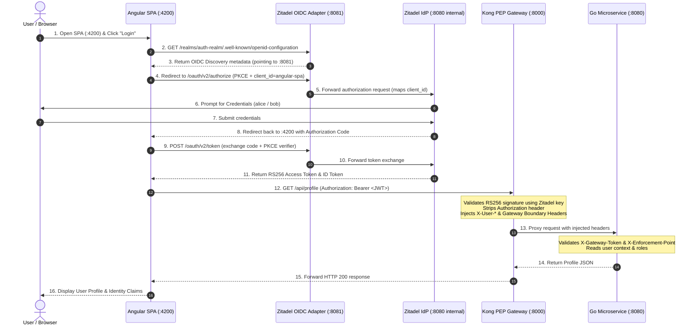

# ZITADEL Implementation Plan: Decoupled IdP Integration

This implementation plan details the architecture, configuration, and deployment steps to add **ZITADEL** as an alternative Identity Provider (IdP) to the existing Keycloak setup, without modifying Keycloak, preserving the zero-trust decoupled architecture, and keeping the **Angular SPA completely unchanged**.

---

## 1. Context & Architectural Overview

The Project Auth Architecture PoC demonstrates the strict decoupling of user identity verification (IdP) from policy enforcement (Kong PEP Gateway) and business logic (Go Microservice).

Both solutions (**Keycloak** and **ZITADEL**) share the same HTTP ports and network contracts, as they are **not intended to run at the same time**:

| Port | Service Component | Description / Contract |
|---|---|---|
| **`8081`** | **Identity Provider (IdP)** | Zitadel OIDC endpoints + compatibility adapter on `:8081` |
| **`8000`** | **Kong PEP Gateway** | Enforces JWT validation, strips `Authorization`, injects `X-User-*` headers |
| **`8001`** | **Kong Admin API** | Declarative configuration management |
| **`8080`** | **Go Backend** | Enforces `X-Gateway-Token`, `X-Enforcement-Point`, and RBAC |
| **`4200`** | **Angular SPA** | Unmodified frontend application (PKCE Code Flow) |

### Runtime Interaction Diagram



---

## 2. Key Architecture Decisions

### 2.1 Preserving Existing Keycloak Setup
- `docker-compose.yml`, `keycloak/`, and existing configuration files remain completely untouched.
- Keycloak can be started at any time using:
  ```bash
  docker compose up -d
  ```

### 2.2 Dedicated Docker Compose for ZITADEL
- A new dedicated file, `docker-compose.zitadel.yml`, orchestrates the entire Zitadel stack using the standard ports (`8081`, `8000`, `8080`, `4200`).
- Start the Zitadel stack at any time using:
  ```bash
  docker compose -f docker-compose.zitadel.yml up -d
  ```

### 2.3 Keeping Angular SPA 100% Without Changes
- The Angular SPA's built bundle expects:
  - Issuer: `http://localhost:8081/realms/auth-realm`
  - Client ID: `angular-spa`
- An Nginx-based OIDC compatibility adapter runs on port `8081` in front of Zitadel to:
  1. Serve the discovery document at `/realms/auth-realm/.well-known/openid-configuration`.
  2. Proxy all OIDC requests (`/oauth/v2/authorize`, `/oauth/v2/token`, `/oauth/v2/keys`, `/oidc/v1/userinfo`, `/oauth/v2/userinfo`) to Zitadel.
  3. Seamlessly map `client_id=angular-spa` to Zitadel's system-generated client ID.
- **Result**: Zero changes to `frontend/src/` or `Dockerfile.frontend`.

### 2.4 Kong Gateway RS256 Token Verification for ZITADEL
- Kong uses a dedicated declarative configuration (`kong/kong.zitadel.yml`).
- Kong consumer `project-client` validates tokens issued by Zitadel via the public RS256 key.
- The Lua `post-function` plugin extracts user claims (`preferred_username`, `email`, and roles from Zitadel's `urn:zitadel:iam:org:project:roles` or flat `roles`) and injects the standardized `X-User-*` headers.

---

## 3. Demo Credentials Matrix (ZITADEL Stack)

Users and roles mirror the existing Keycloak test accounts:

| Username | Password | Email | Assigned Role | Expected Behavior |
|---|---|---|---|---|
| **`alice`** | **`alice123`** | `alice@example.com` | `user` | **Standard User**: HTTP 200 on `/api/profile`, **HTTP 403 Forbidden** on `/api/admin`. |
| **`bob`** | **`bob123`** | `bob@example.com` | `admin`, `user` | **Administrator**: HTTP 200 on `/api/profile`, **HTTP 200 Authorized** on `/api/admin`. |
| **`admin`** | **`admin`** | `admin@example.com` | `IAM_OWNER` | **Zitadel Console Admin** ([http://localhost:8081/ui/console](http://localhost:8081/ui/console)). |

---

## 4. Proposed Implementation Files

### 4.1 New Files

1. **`docker-compose.zitadel.yml`**
   - Orchestrates services:
     - `zitadel-db`: PostgreSQL 16 container for Zitadel data.
     - `zitadel`: `ghcr.io/zitadel/zitadel:v2.68.0` with `start-from-init` and local HTTP configuration.
     - `zitadel-bootstrap`: Automated initialization container to create the organization, project, roles (`user`, `admin`), users (`alice`, `bob`), and OIDC SPA client.
     - `idp-proxy`: Lightweight Nginx adapter listening on `0.0.0.0:8081`.
     - `kong`: Kong 3.6 PEP gateway mounting `kong/kong.zitadel.yml` on ports `8000` & `8001`.
     - `go-backend`: Decoupled Go microservice built from `./backend` on port `8080`.
     - `frontend`: Unmodified Angular SPA built from `./frontend` on port `4200`.

2. **`zitadel/proxy.conf`**
   - Nginx routing rules for `:8081`:
     - Rewrites `/realms/auth-realm/.well-known/openid-configuration` to Zitadel's discovery endpoint.
     - Translates `client_id=angular-spa` into the Zitadel application client ID for `/oauth/v2/authorize` and `/oauth/v2/token`.
     - Proxies static assets, console UI (`/ui/console`), and OIDC API calls to Zitadel.

3. **`zitadel/bootstrap.sh`**
   - Idempotent provisioning script:
     - Waits for Zitadel readiness on `http://zitadel:8080/debug/healthz`.
     - Authenticates as admin and creates the project, roles (`user`, `admin`), and demo users (`alice`, `bob`).
     - Creates the OIDC application with redirect URI `http://localhost:4200`.
     - Writes the generated Client ID to the shared proxy config volume.
     - Fetches Zitadel's RS256 public key (from `/oauth/v2/keys`) and writes `kong/kong.zitadel.yml` dynamically or updates the public key block.

4. **`kong/kong.zitadel.yml`**
   - Kong declarative configuration matching Zitadel's token claims and public key.

### 4.2 Updated Files

1. **`README.md`**
   - Update documentation to include commands for running with Keycloak vs. ZITADEL.
   - Document Zitadel credentials and architecture notes.

---

## 5. Verification & Testing Plan

### 5.1 Pre-Execution Checks
1. Ensure the Keycloak stack is stopped if running:
   ```bash
   docker compose down
   ```
2. Start the Zitadel stack:
   ```bash
   docker compose -f docker-compose.zitadel.yml up -d
   ```

### 5.2 Automated Endpoint Verification
- **Zitadel Health**: Verify `curl -I http://localhost:8081/debug/healthz` returns `200 OK`.
- **OIDC Discovery**: Verify `curl -s http://localhost:8081/realms/auth-realm/.well-known/openid-configuration | jq .issuer` returns the expected endpoint.
- **JWKS Key Extraction**: Verify `curl -s http://localhost:8081/oauth/v2/keys` contains active RS256 keys.

### 5.3 Manual End-to-End Flow (Browser)
1. Navigate to [http://localhost:4200](http://localhost:4200).
2. Click **Login with Keycloak / IdP** button.
3. Verify redirection to the Zitadel login screen at `http://localhost:8081`.
4. Log in as **`alice`** (`alice123`):
   - Redirects back to `http://localhost:4200`.
   - Verify username `alice` and role `user` are rendered.
   - Click **Call /api/profile via Gateway**: Confirm **HTTP 200 OK**.
   - Click **Call /api/admin via Gateway**: Confirm **HTTP 403 Forbidden**.
5. Log out and log in as **`bob`** (`bob123`):
   - Verify username `bob` and role `admin` are rendered.
   - Click **Call /api/admin via Gateway**: Confirm **HTTP 200 OK**.
6. Click **Call /api/profile Direct Bypass**: Confirm **HTTP 403 Forbidden** (Zero-Trust boundary preserved).

### 5.4 Reversibility Check
- Stop Zitadel: `docker compose -f docker-compose.zitadel.yml down`
- Start Keycloak: `docker compose up -d`
- Verify Keycloak functions exactly as before with no regression.
